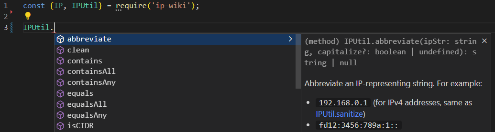
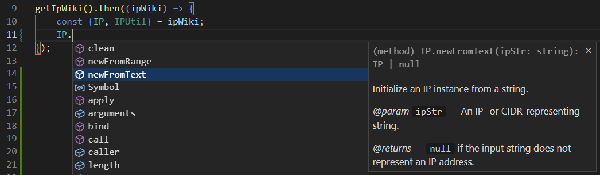

# `ip-wiki` — IP Address Utility Library for Wikipedia and NodeJS

> [!NOTE]
> This module has yet to be published. Please wait for version 1.x.x to get ready.

`ip-wiki` is a JavaScript library that provides classes to manipulate IP and CIDR addresses. The library has been developed for use on Wikipedia, but it also works as a NodeJS module.

- :heavy_check_mark: **[API documentation](https://dr4goniez.github.io/ip-wiki/index.html)** is avaiable!
- :heavy_check_mark: The library can be used in TypeScript environments!
- :heavy_check_mark: No external dependencies!

## Installation
```
npm install ip-wiki
```
If you only need type definitions:
```
npm install -D ip-wiki
```

## Usage
### NodeJS
In CommonJS:
```js
const {IP, IPUtil} = require('ip-wiki');
```
In ES modules:
```js
import {IP, IPUtil} from 'ip-wiki';
```
Then:



### Wikipedia

Load and import [ja:MediaWiki:Gadget-ip-wiki.js](https://ja.wikipedia.org/wiki/MediaWiki:Gadget-ip-wiki.js). In this case, this package is for Intellisense (you may also want to install [types-mediawiki](https://www.npmjs.com/package/types-mediawiki) as a dev dependency).
```js
/**
 * @returns {JQueryPromise<import('ip-wiki')>}
 */
function getIpWiki() {
	const gadget = 'ext.gadget.ip-wiki';
	return mw.loader.using(gadget).then((req) => req(gadget));
}

getIpWiki().then((ipWiki) => {
	const {IP, IPUtil} = ipWiki;
	// ...
});
```
Note that you may need to cross-wiki-load the gadget if a module named `ip-wiki` is not defined in the local Gadgets-deinition:
```js
/**
 * @returns {JQueryPromise<import('ip-wiki')>}
 */
function getIpWikiX() {
	const gadget = 'ext.gadget.ip-wiki';
	return mw.loader.getScript('https://ja.wikipedia.org/w/load.php?modules=' + gadget).then(() => {
		return mw.loader.using(gadget).then((req) => req(gadget));
	});
}
```

Then:



## Classes
This library has two main classes: the [IP](https://dr4goniez.github.io/ip-wiki/classes/IP.html) class and the static [IPUtil](https://dr4goniez.github.io/ip-wiki/classes/IPUtil.html) class:
* Use the IP class when you need to do manipulations on the same IP recursively (more efficient than to use IPUtil because we can skip the parsing process of the relevant input IP string).
* Use the IPUtil class for one-time manipulations (i.e. when there is no need to create a class instance).

### Class IP
Suppose that you need to retrieve the indexes of IP-representing elements in `ipArr` array that equal the IP address `192.168.1.1`:
```js
const ip = IP.newFromText('192.168.1.1');
if (!ip) {
	return;
}
const ipArr = [
	'192.168.1.1/32',
	'::1',
	'192.168.001.001'
];
const indexes = ipArr.reduce(/** @param {number[]} acc */ (acc, ipStr, i) => {
	if (ip.equals(ipStr)) {
		acc.push(i);
	}
	return acc;
}, []);
console.log(indexes); // [ 0, 2 ]

```

### Class IPUtil
Suppose that you need to filter the `ipArr` array for it to only contain IPv6 addresses and CIDRs:
```js
const ipArr = [
	'192.168.1.1/32',
	'::1',
	'192.168.001.001'
];
const filtered = ipArr.filter((ip) => IPUtil.isIPv6(ip, true));
console.log(filtered); // [ '::1' ]
```

### Methods
For a number of other methods, see the **[API documentation](https://dr4goniez.github.io/ip-wiki/index.html)**!